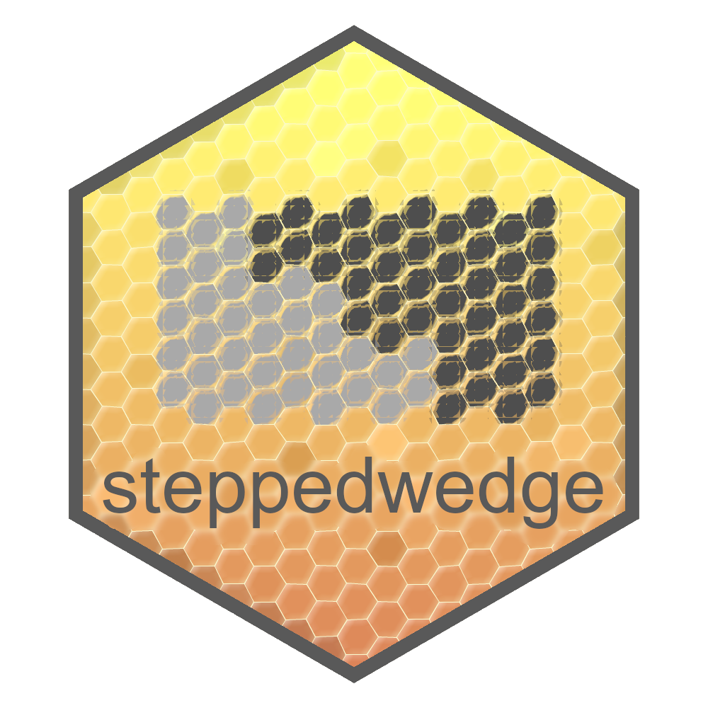

<!-- badges: start -->
  
  [](https://CRAN.R-project.org/package=steppedwedge)
  
  [](https://github.com/Avi-Kenny/steppedwedge/actions/workflows/R-CMD-check.yml)
  [](https://app.codecov.io/gh/Avi-Kenny/steppedwedge)
  
  
  
  [](https://CRAN.R-project.org/package=steppedwedge)
  
  
  
<!-- badges: end -->


# steppedwedge 

An R package for analyzing data from stepped wedge cluster randomized trials

## Overview

**steppedwedge** is an open-source R package designed for analyzing data from stepped wedge cluster randomized trials. Functions are given for checking/visualizing datasets and estimating various treatment effect parameters, including the immediate treatment effect (ITE), exposure time averaged treatment effect (ETATE), calendar time averaged treatment effect (CTATE).

## Installation

The latest stable version of **steppedwedge** can be installed from CRAN using `install.packages()`:

```R
install.packages("steppedwedge")
```

The current development version can be installed using `devtools::install_github()`:

```R
devtools::install_github(repo="Avi-Kenny/steppedwedge")
```

## Documentation

The full package documentation can be found at [https://avi-kenny.github.io/steppedwedge/](https://avi-kenny.github.io/steppedwedge/).

## Bugs reports and feature requests

To submit a bug report or request a new feature, please submit a new [GitHub Issue](https://github.com/Avi-Kenny/steppedwedge/issues).
