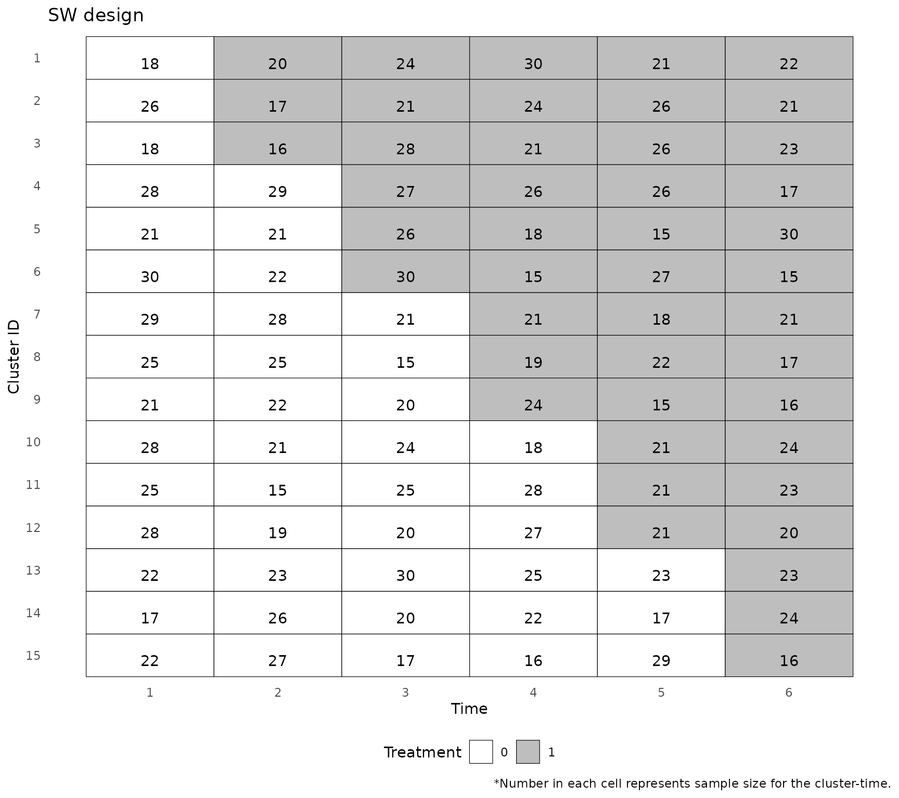
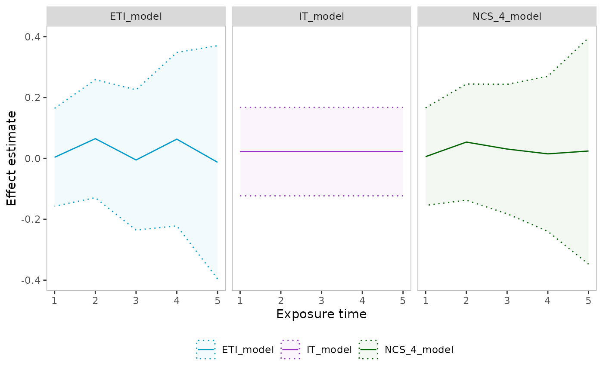

# Basic package workflow

``` r
library(steppedwedge)
```

The `load_data` function takes in raw data and creates a data object
that can be accepted by the `plot_design` and `analyze` functions. We
use the made-up dataframe `sw_data_example` to demonstrate the workflow.

``` r
data(sw_data_example)
head(sw_data_example)
#>   cluster period trt outcome_bin outcome_cont
#> 1       1      1   0           0  -3.02179837
#> 2       1      1   0           0  -0.07145287
#> 3       1      1   0           1   0.96807617
#> 4       1      1   0           0   0.29456948
#> 5       1      1   0           1  -0.83921584
#> 6       1      1   0           1  -0.42335941

dat <- load_data(
  time = "period",
  cluster_id = "cluster",
  individual_id = NULL,
  treatment = "trt",
  outcome = "outcome_bin",
  data = sw_data_example
)
#> Stepped wedge dataset loaded. Discrete time design with 15 clusters, 5 sequences, and 6 time points.
```

The `plot_design` function produces a diagram of the stepped wedge
design and a summary of the variables.

``` r
plot_dat <- plot_design(dat)

print(plot_dat)
#> $design_plot
```



The `analyze` function analyzes the stepped wedge data. First, we
analyze the data using a mixed effects model, with the Time Average
Treament Effect (TATE) as the estimand, assuming an Immediate Treatment
(IT) effect, passing the `family = "binomial"` and `link = "logit"`
arguments to `glmer`.

``` r
analysis_1 <- analyze(
  dat = dat,
  method = "mixed",
  estimand_type = "TATE", 
  exp_time = "IT",
  family = binomial,
  re = c("clust", "time")
)

print(analysis_1)
#> Treatment effect estimate: 0.39
#> Treatment effect 95% confidence interval: 0.123, 0.656
#> Converged: TRUE
```

Repeat the analysis, but including a random effect for cluster only, not
for cluster-time interaction.

``` r
analysis_1b <- analyze(
  dat = dat,
  method = "mixed",
  estimand_type = "TATE", 
  exp_time = "IT",
  family = binomial,
  re = "clust"
)

print(analysis_1b)
#> Treatment effect estimate: 0.391
#> Treatment effect 95% confidence interval: 0.128, 0.653
#> Converged: TRUE
```

Repeat the analysis, but using GEE rather than a mixed model.

``` r
analysis_2 <- analyze(
  dat = dat,
  method = "GEE",
  estimand_type = "TATE", 
  exp_time = "IT",
  family = binomial,
  corstr = "exchangeable"
)

print(analysis_2)
#> Treatment effect estimate: 0.389
#> Treatment effect 95% confidence interval: 0.138, 0.64
#> Converged:
```

Mixed model, with Time Average Treament Effect (TATE) as the estimand,
using an Exposure Time Indicator (ETI) model.

``` r
analysis_3 <- analyze(
  dat = dat,
  method = "mixed",
  estimand_type = "TATE", 
  exp_time = "ETI",
  family = binomial
)

print(analysis_3)
#> Treatment effect estimate: 0.418
#> Treatment effect 95% confidence interval: 0.102, 0.733
#> Converged: TRUE
```

Mixed model, with Time Average Treatment Effect (TATE) as the estimand,
using a Natural Cubic Splines (NCS) model.

``` r
analysis_4 <- analyze(
  dat = dat,
  method = "mixed",
  estimand_type = "TATE", 
  exp_time = "NCS",
  family = binomial
)

print(analysis_4)
#> Treatment effect estimate: 0.421
#> Treatment effect 95% confidence interval: 0.104, 0.738
#> Converged: TRUE
```

## Continuous outcome

Mixed model, with Time Average Treament Effect (TATE) as the estimand,
using a Natural Cubic Splines (NCS) model.

``` r

dat_cont <- load_data(
  time = "period",
  cluster_id = "cluster",
  individual_id = NULL,
  treatment = "trt",
  outcome = "outcome_cont",
  data = sw_data_example
)
#> Stepped wedge dataset loaded. Discrete time design with 15 clusters, 5 sequences, and 6 time points.

analysis_6 <- analyze(
  dat = dat_cont,
  method = "mixed",
  estimand_type = "TATE", 
  exp_time = "NCS",
  family = gaussian
)

print(analysis_6)
#> Treatment effect estimate: 0.526
#> Treatment effect 95% confidence interval: 0.329, 0.723
#> Converged: TRUE
```

## Binomial outcome

When loading data where the outcome is binomial, specify the names of
the “# of successes” and “# of trials” variables as the `outcome`
argument.

``` r

dat_binom <- load_data(
  time ="period",
  cluster_id = "cluster",
  individual_id = NULL,
  treatment = "trt",
  outcome = c("numerator", "denominator"),
  data = sw_data_example_binom
)
#> Stepped wedge dataset loaded. Discrete time design with 15 clusters, 5 sequences, and 6 time points.
```

Mixed model, with Time Average Treament Effect (TATE) as the estimand,
using an Exposure Time Indicator (ETI) model.

``` r

analysis_binom <- analyze(
  dat = dat_binom,
  method = "mixed",
  family = binomial,
  estimand_type = "TATE", 
  exp_time = "ETI")
#> boundary (singular) fit: see help('isSingular')

print(analysis_binom)
#> Treatment effect estimate: 0.696
#> Treatment effect 95% confidence interval: 0.397, 0.996
#> Converged: TRUE
```

## Plotting effect curves

The `plot_effect_curve` function plots effect estimates by exposure time
for one or more `analyze` objects.

``` r

IT_model <- analyze(
  dat = dat_cont, method = "mixed", estimand_type = "TATE",
  estimand_time = c(1, 4), exp_time = "IT"
)
ETI_model <- analyze(
  dat = dat_cont, method = "mixed", estimand_type = "TATE", 
  estimand_time = c(1, 4), exp_time = "ETI"
)
NCS_4_model <- analyze(
  dat = dat_cont, method = "mixed", estimand_type = "TATE",
  estimand_time = c(1, 4), exp_time = "NCS", 
  advanced = params(n_knots_exp = 4)
)

plot_effect_curves(IT_model, NCS_4_model, ETI_model, facet_nrow = 1)
```


